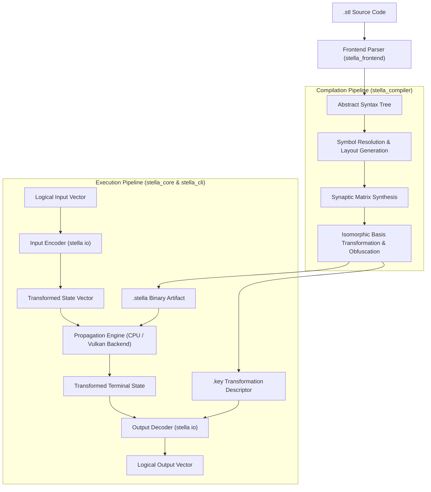

# Stella

**A Continuous-State Neural Virtual Machine for Spatially Obfuscated Logic Execution**

[](https://www.gnu.org/licenses/agpl-3.0)
[](https://www.rust-lang.org/)
[]()

> [!IMPORTANT]
> Stella is an experimental research system for continuous-state execution, linear algebraic obfuscation, and fixed-point neural runtime architectures. Specifications and implementations are subject to ongoing refinement.

---

Stella investigates a non-von Neumann execution model designed to execute deterministic computations within continuous, encrypted state spaces. Rather than evaluating sequential instructions across addressable registers and program counters, Stella compiles source programs into dense weight matrices governing fixed-point dynamical systems.

At runtime, machine state persists as continuous activation vectors mapped over recurrent linear transformations and bounded non-linear transfer functions. The execution semantics prevent external inspection of intermediate instruction boundaries, control-flow graphs, and data-flow paths without possession of the private geometric decoding transformation.

This repository provides the reference implementation of the Stella toolchain, comprising the frontend parser, intermediate representations, matrix compiler, affine basis obfuscation passes, and runtime engines.

---

## Research Objectives

1. **Continuous-State Execution**: Transforming discrete arithmetic and conditional control flow into continuous recurrent matrix projections over deterministic fixed-point fields.
2. **Attractor-Based Control Flow**: Realizing branching, synchronization, and state retention through dynamical attractor basins and phase transitions rather than discrete jump instructions.
3. **Isomorphic Basis Obfuscation**: Mapping linear operator manifolds through conjugate transformation pairs ($W' = P^{-1} W P$) to disperse semantic structures across the coordinate space while preserving observational equivalence.
4. **Side-Channel Mitigation**: Coupling non-computational orthogonal subspaces to irrational non-periodic orbits, eliminating static correlation in physical power and electromagnetic radiation profiles.
5. **Deterministic Signal Propagation**: Modeling discrete pipeline stages as discrete-time dynamical systems with bounded propagation delays and exact integer fixed-point convergence.

---

## Architecture



---

## Mathematical Formulation

The core execution step updates the system state vector $S_t \in \mathbb{Q}^{N}$ on each discrete time step $t$ according to:

$$S_{t+1} = \sigma\left(W \cdot S_t + B\right)$$

Where:
- $W \in \mathbb{Q}^{N \times N}$ is the recurrent synaptic connection matrix.
- $B \in \mathbb{Q}^{N}$ is the bias offset vector.
- $S_t \in \mathbb{Q}^{N}$ represents the active state across input terminals, internal nodes, and output terminals.
- $\sigma(x) = \min(1, \max(0, x))$ denotes the saturating linear activation function.

Numerical stability is maintained through a Q32.32 fixed-point representation, ensuring identical algebraic results across target architectures independent of host floating-point rounding modes.

### Basis Transformation & Obfuscation

Given a canonical circuit description $(W, B)$, the compiler derives an obfuscated representation by selecting an affine transformation $(P, D, T)$ over the hyperoctahedral group $\mathbb{Z}_2^N \rtimes S_N$:

$$W' = D^{-1} P^{-1} W P D$$

$$B' = P^{-1} B + T$$

The resulting representation eliminates direct register-to-index correlations, structural sparsity signatures, and known graph topologies without perturbing decoded output values.

---

## Language Specifications

Programs are declared using the Stella DSL (`.stl`), expressing continuous connections, signal routing, phase transitions, and structural constraints.

### Signal Flow and Filtering

```stl
terminal in raw_sensor;
terminal out norm_out;
terminal out inv_out;
terminal out emergency_cutoff;

node status_bus : hold;

raw_sensor ~> (
    |> saturate * 1.5 |> relu ~> [norm_out, status_bus],
    |> inv * 0.75 ~> inv_out,
    |> step * 2.0 ~> emergency_cutoff
);

assert stable;
```

### Phase Automata and Attractor Dynamics

```stl
terminal in error_sig;
terminal out ctrl_gain;
terminal out tracking_locked;

node integrator : leak(0.95);

phase ServoController {
    state Acquiring {
        integrator = error_sig * 0.8;
        drift Locked when error_sig < 0.15;
    }

    state Locked {
        integrator = error_sig * 0.1;
        drift Acquiring when error_sig > 0.65;
    }
}

ctrl_gain = state.Acquiring * 0.9 + state.Locked * 0.15;
tracking_locked = state.Locked;

probe "gain", ctrl_gain;
probe "locked", tracking_locked;
```

### Modular Circuit Templates

```stl
circuit FilterNode<decay = 0.85, gain = 1.2>(in raw, out filtered) {
    node acc : leak(0.85);
    acc = raw * gain;
    acc ~> filtered;
}

terminal in sig_a;
terminal in sig_b;
terminal out winner_a;
terminal out winner_b;

inst f_a = FilterNode<0.90, 1.0>(sig_a, winner_a);
inst f_b = FilterNode<0.80, 1.5>(sig_b, winner_b);

compete {
    winner_a;
    winner_b;
} resolve winner_take_all(0.5);

assert stable;
```

---

## Toolchain & Usage

### Compilation

Compile a `.stl` source specification into a serialized matrix binary:

```bash
# Standard compilation
stella compile examples/basin_servo.stl -o target/basin_servo.stella

# Obfuscated compilation with geometric basis permutation
stella compile examples/basin_servo.stl -o target/basin_servo.stella --obfuscate --pad-size 32
```

### Execution

Execute the compiled matrix using the single-instance runtime or batch execution backends:

```bash
# Execute compiled binary with input vector
stella run target/basin_servo.stella 0.12 0.0

# Execute until dynamical stability convergence
stella run target/basin_servo.stella 0.12 0.0 --until-stable

# Execute with private decoding key for obfuscated artifacts
stella run target/basin_servo.stella 0.12 0.0 --key target/basin_servo.key

# GPU-accelerated execution via Vulkan backend
stella run target/basin_servo.stella 0.12 0.0 --gpu
```

### Cryptanalysis Verification

Verify structural resistance against permutation recovery on unpadded modules:

```bash
stella disasm examples/basin_servo.stl target/basin_servo.stella
```

---

## Workspace Crates

| Crate | Responsibility |
|---|---|
| [`stella_core`](crates/stella_core) | Q32.32 fixed-point arithmetic, dense matrix primitives, and propagation engine |
| [`stella_frontend`](crates/stella_frontend) | Lexer, parser, AST structures, and symbol resolution |
| [`stella_compiler`](crates/stella_compiler) | Matrix synthesis, affine basis transformation, and serialization routines |
| [`stella_cli`](crates/stella_cli) | Command-line interface and invocation driver |
| [`stella_gpu`](crates/stella_gpu) | Parallel matrix evaluation backends (Vulkan / WGPU compute pipelines) |

---

## Cryptographic and Analysis Resistance

| Threat Vector | Mitigation Mechanism |
|---|---|
| Static Binary Inspection | Dense continuous representations without instruction boundaries or static opcode sequences. |
| Control-Flow Reconstruction | Control-flow graphs are unified into single-node recurrent dynamical attractors. |
| Symbolic Execution | Affine basis conjugation and nilpotent projections expand constraint complexity across non-linear equations. |
| Differential Power Analysis | Decoupled orthogonal subspaces evaluate continuous irrational trajectories to randomize power distribution. |
| Known-Plaintext Structural Attacks | State-space expansion through dummy dimensions ($N \ge 32$) rendering permutation search spaces computationally intractable ($N! \ge 2.63 \times 10^{35}$). |

---

## License

Licensed under the GNU Affero General Public License v3.0 (AGPL-3.0). See [LICENSE](LICENSE).

---

<div align="center">

Built with 🦀 & ⏳ by [Seuriin](https://github.com/SSL-ACTX)

</div>
